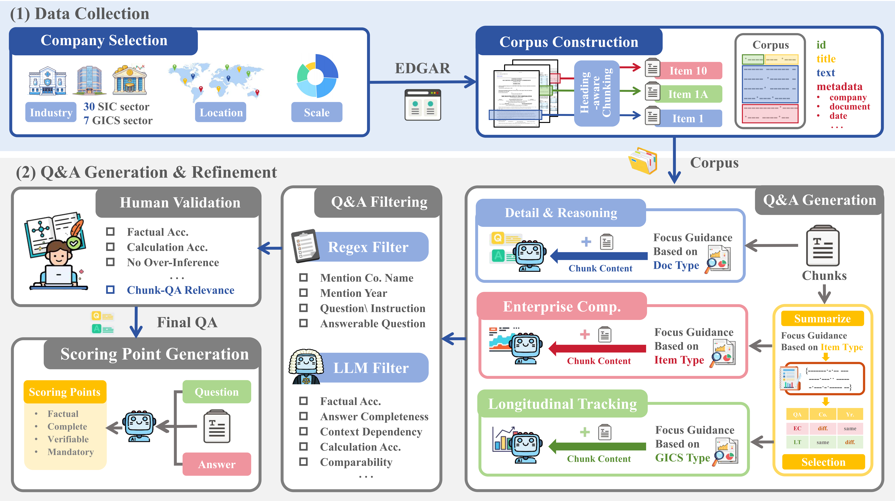
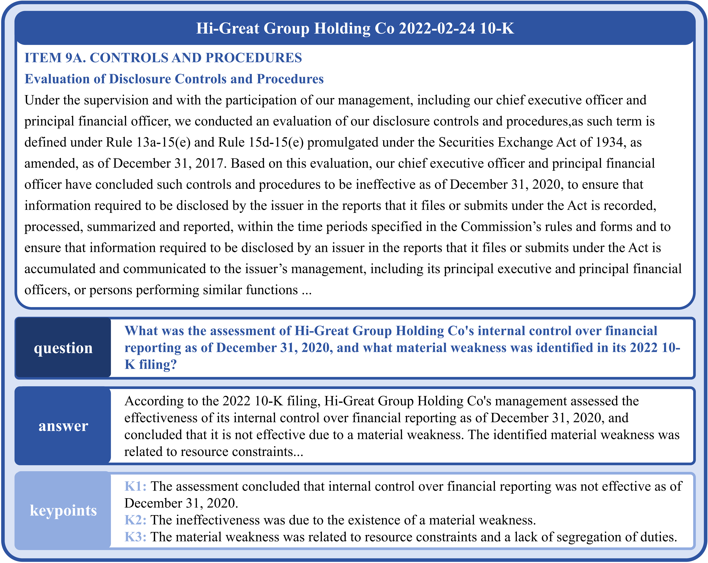
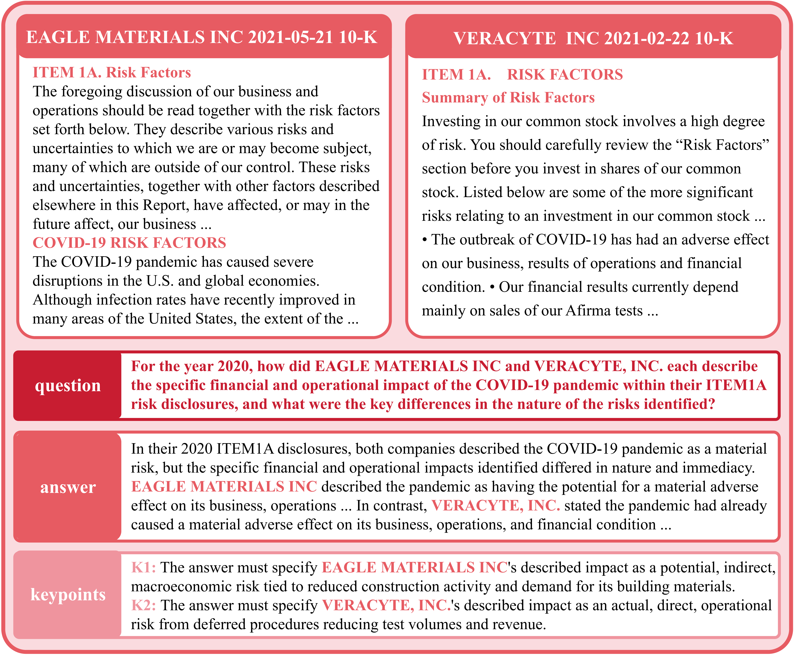
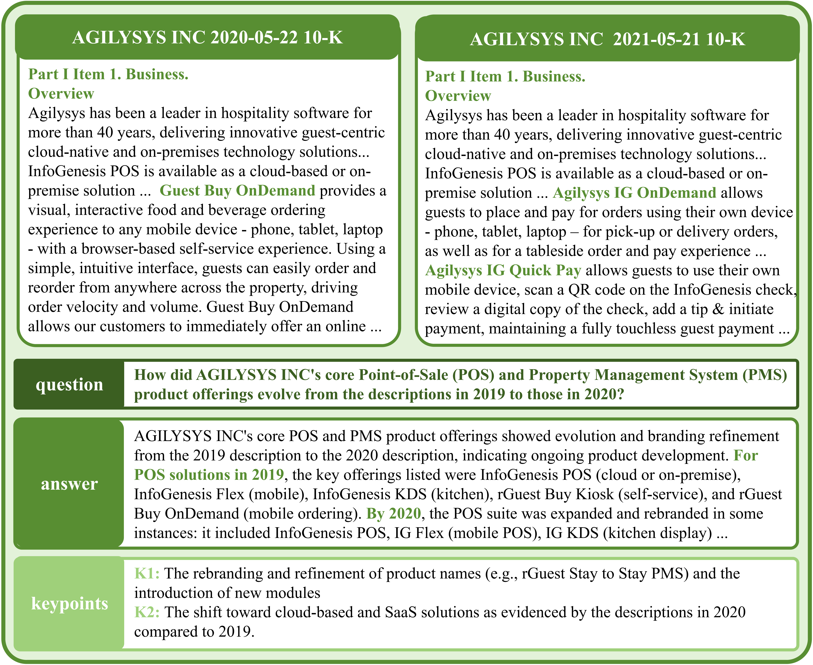

# 📝 Fin-RATE: Financial Analytics and Tracking Evaluation Benchmark for LLMs on SEC Filings



**Fin-RATE** is a real-world benchmark to evaluate large language models (LLMs) on professional-grade reasoning over **U.S. SEC filings**. 
It targets financial analyst workflows that demand:

- 📄 **Long-context understanding**
- ⏱️ **Cross-year tracking**
- 🏢 **Cross-company comparison**
- 📊 **Structured diagnosis of model failures**

> 📘 [Paper (arXiv link TBD)] | 🔗 [Leaderboard (Coming Soon)] | 🤗 [Dataset](https://huggingface.co/datasets/JunrongChen2004/Fin-RATE)
> ⬇️ SEC-based QA benchmark with 7,500 instances + interpretable evaluation.

---

## 🔍 Overview

Fin-RATE includes **three core QA tasks**, modeling real-world financial reasoning:


| Task Type | Description                                                  |
| --------- | ------------------------------------------------------------ |
| **DR-QA** | Detail & Reasoning: fine-grained reasoning within one SEC section |
| **EC-QA** | Enterprise Comparison: reasoning across peer firms in the same industry/year |
| **LT-QA** | Longitudinal Tracking: analyzing trends across years for the same firm |

### DR-QA Example

<center>

</center>


### EC-QA Example

<center>

</center>


### LT-QA Example

<center>

</center>


---

## 📦 Dataset Structure

```bash
Fin-RATE/
├── corpus/            # Parsed and chunked SEC filings
│   └── corpus.zip
├── qa/                # QA datasets
│   ├── dr_qa.json
│   ├── ec_qa.json
│   └── lt_qa.json
├── evaluation/        # evaluation metrics using LLM judge (including verdicts, error taxonomy, fine-grained dimensions)
│   └── qa_llm_judge.py
└── requirements.txt
```

---
## 🛠️ Usage
1. Environment setup
```bash
cd Fin-RATE
conda create -n evaluation python==3.10
conda activate evaluation
conda install requirements.txt
```
2. Download and Decompression corpus zip from [Huggingface](https://huggingface.co/datasets/JunrongChen2004/Fin-RATE)
```bash
unzip corpus/corpus.zip
```
3. Run Model Generation on QAs
```bash
export AZURE_OPENAI_API_KEY=""
python generation/qa_generation.py \
    --input_path qa/dr_qa.json \
    --output-dir results/dr \
    --deployment [model_type] \
    --corpus corpus/corpus.jsonl
```
4. Run Model Evaluation using LLM Judge
```bash
export AZURE_OPENAI_KEY=""
python evaluation/qa_llm_judge.py \
     --input_json [output file path from step 3] \
     --out_dir results/judge \
     --corpus corpus/corpus.jsonl \
     --judge_backend [choices: gpt, ollama] \
     --openai_model [model_type]
```


